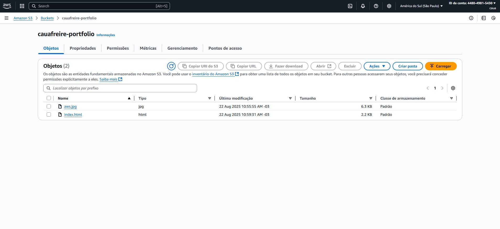

# Projeto: Site Estático na AWS

### Descrição
Este projeto demonstra a criação e hospedagem de um site estático, utilizando serviços essenciais da AWS. O objetivo principal é aplicar conhecimentos em arquitetura de nuvem e seguir as melhores práticas para hospedagem de conteúdo web de forma eficiente e escalável.

* **Observação:** O serviço Amazon Route 53 não foi utilizado neste projeto, pois o objetivo era focar na distribuição via CloudFront e S3. O acesso ao site é feito diretamente pela URL gerada pelo CloudFront.

### Serviços Utilizados
* **Amazon S3:** Usado para armazenar o site de forma segura e com alta disponibilidade.
* **Amazon CloudFront:** Configurado como uma CDN (Content Delivery Network) para distribuir o conteúdo globalmente, reduzindo a latência e melhorando a velocidade de carregamento.

### Passo a Passo da Implementação
1.  **Criação do Bucket S3:**
    * Um bucket S3 foi criado para servir como repositório para os arquivos do site.
2.  **Configuração do Bucket:**
    * As permissões do bucket foram ajustadas para acesso público, garantindo que o CloudFront possa ler os arquivos.
3.  **Upload dos Arquivos:**
    * Os arquivos HTML, CSS e imagens foram carregados para o bucket S3.
4.  **Configuração do CloudFront:**
    * Uma distribuição do CloudFront foi criada, utilizando o bucket S3 como "origem" (source).
5.  **Teste e Validação:**
    * O acesso ao site foi testado e validado através do endpoint público do CloudFront, confirmando que a distribuição está funcionando corretamente.

### Etapas do Projeto com Imagens
*  **Bucket S3 configurado:** Mostra a criação do bucket...
*  **Arquivos Carregados:** Confirma o upload dos arquivos `index.html` e `aws.jpg` no bucket.
*  **Distribuição CloudFront:** Exibe a distribuição CloudFront criada...
*  **Site Acessível pela URL:** Demonstra o site de portfólio...
  
### Aprendizados
* **Hospedagem de Site Estático:** Ganhos em eficiência e custo usando S3.
* **CDN (CloudFront):** Entendimento de como o CloudFront melhora a performance e a segurança de sites, distribuindo o conteúdo em cache globalmente.
* **Arquitetura Serverless e Escalável:** A primeira experiência prática com uma arquitetura simples, mas altamente escalável.

### Próximos Passos
* Futuramente, este projeto pode ser expandido com a integração do Amazon Route 53 para o uso de um domínio personalizado.
